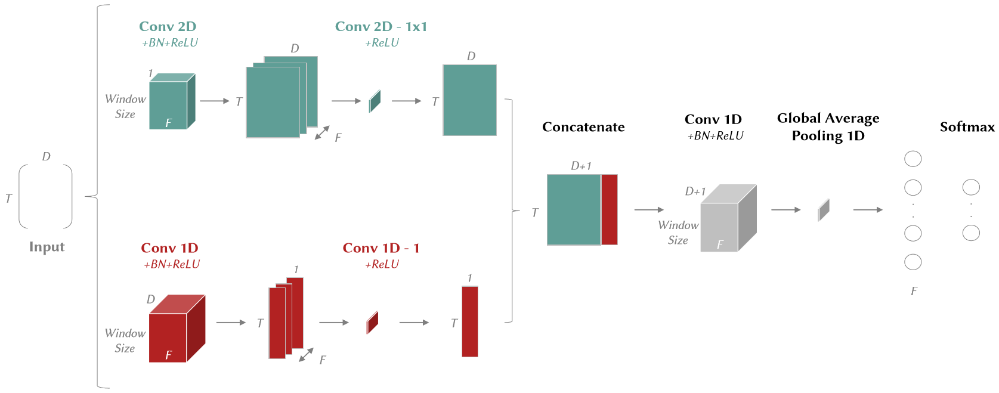
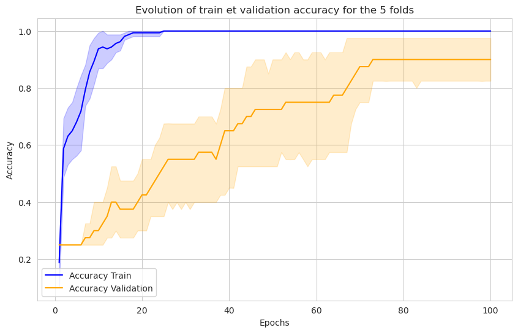
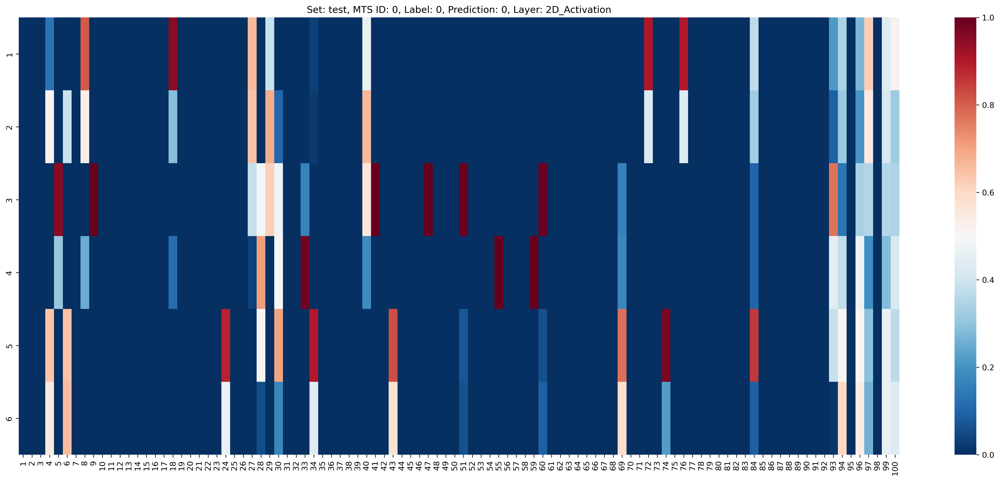
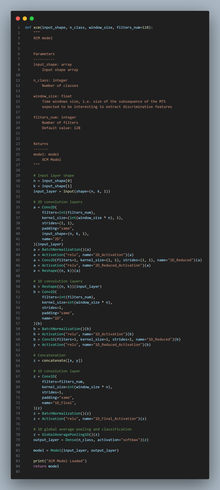

+++
title = 'XCM, an explainable CNN for MTS classficiation'
date = 2024-03-26T00:55:40+01:00
draft = false
+++

<h1 style="font-size: 36px;">XCM: An Explainable Convolutional Neural Network for Multivariate Time Series Classification</h1>
<h3 style="font-size: 24px;">Authors : Nicolas SAINT & Matthis Guérin</h3>

<h4 style="font-size: 22px;">Table of Contents
</h4>

- [1. Introduction](#1-introduction)
- [2. Related Work](#2-related-work)
- [3. XCM](#3-xcm)
- [4. Evaluation](#4-evaluation)
- [5. Results](#5-results)
- [6. Implementation](#6-implementation)
- [7. Conclusion](#7-conclusion)
- [Appendix](#appendix)
- [References](#references)

### 1. Introduction

The classification of multivariate time series (MTS) has emerged as an increasingly important research area over the last decade, driven by the exponential growth of temporal data across various domains such as finance, healthcare, mobility, and natural disaster prediction . A time series is a sequence of real values ordered in time, and when a set of co-evolving series is recorded simultaneously by a set of sensors, it is referred to as an MTS. MTS classification, which involves learning the relationship between an MTS and its label, presents a significant challenge due to the inherent complexity of the multivariate and temporal nature of the data.

Traditional approaches to MTS classification, while effective on large datasets, encounter significant limitations such as poor generalization on small datasets and a lack of explainability, which can limit their adoption in sensitive applications where understanding the model's decisions is crucial . For example, the European GDPR regulation highlights the importance of providing meaningful explanations for automated decisions, emphasizing the need for approaches capable of reconciling performance and explainability .

### 2. Related Work

The existing literature on MTS classification can be broadly grouped into three main categories: similarity-based methods, feature-based methods, and deep learning approaches.

**Similarity-based methods**: These methods utilize similarity measures to compare two MTS. Dynamic Time Warping (DTW) combined with the nearest neighbor rule (k-NN) has shown impressive performance, although it is not without limitations, particularly in terms of computational cost and the absence of an explicit feature representation.

**Feature-based methods**: Approaches such as shapelets and Bag-of-Words (BoW) models transform time series into a more manageable feature space. WEASEL+MUSE, for instance, uses a symbolic Fourier approximation to create a BoW representation of MTS, enabling efficient classification using logistic regression.

**Deep learning approaches**: The advent of Convolutional Neural Networks (CNNs) and Long Short-Term Memory (LSTM) networks has opened new avenues for MTS classification, thanks to their ability to automatically learn complex data representations. MLSTM-FCN, combining LSTM and CNN, has been identified as one of the top-performing models, despite its complexity and difficulty in providing explanations for its decisions.

Explainability of MTS classification models has become a major concern, particularly for critical applications. Post-hoc methods, such as LIME and SHAP, offer ways to generate explanations for black-box models, but these explanations may lack fidelity to the model's internal workings. This underscores the need for approaches that inherently integrate explainability into the model design.

In this context, our work presents XCM, an innovative convolutional neural network architecture for MTS classification, that not only outperforms existing approaches in terms of performance but also provides reliable and intuitive explanations for its predictions, directly addressing the challenges of performance and explainability in MTS classification. This approach is grounded on the foundational work presented in the paper "XCM: An Explainable Convolutional Neural Network for Multivariate Time Series Classification", which offers a novel solution to the pressing needs in the domain of MTS classification.

### 3. XCM

**Architecture**

XCM's architecture is specifically designed to efficiently address the challenge of multivariate time series (MTS) classification by simultaneously extracting relevant information about observed variables and time directly from the input data. This unique approach allows XCM to capture the complexity and inherent interactions within MTS, thereby enhancing its generalization capability across different datasets and its applicability in various application contexts.

To achieve this, XCM employs a combination of parallel 2D and 1D convolution filters. The 2D filters focus on extracting features related to observed variables at each time instant, while the 1D filters capture temporal dynamics across all variables.

**2D Convolution Formula for Observed Variables**: $$A^{(k)} = f(W^{(k)} * X + b^{(k)})$$

- $A^{(k)}$: représente la carte des caractéristiques activées pour le k-ème filtre.
- $f$: denotes the activation function, often ReLU, to introduce non-linearity.
- $W^{(k)}$, $b^{(k)}$: weights and bias of the $k$-th 2D convolution filter.
- $X$: the input MTS data.
- $*$: the convolution operation.

By extracting features in this manner, XCM is able to detect complex patterns in MTS that are crucial for precise series classification.

**1D Convolution Formula for Temporal Information**: $$M^{(k)} = f(W^{(k)} \circledast X + b^{(k)})$$

- $M^{(k)}$: the activated feature map resulting from 1D filters.
- $\circledast$: the 1D convolution operation focusing on the temporal dimension.

This dual convolution approach enables XCM to maintain high accuracy while offering a better understanding of the contributions of different variables and temporal dynamics to the final decision.

**Explainability**

One of the hallmark features of the XCM architecture is its inherent capability to provide explainable predictions, leveraging the Gradient-weighted Class Activation Mapping (Grad-CAM) technique. Grad-CAM produces heatmaps that highlight the regions of the input data that most significantly contribute to a specific class prediction. This feature is crucial for applications where understanding the model's reasoning is as important as the prediction accuracy itself.

**Grad-CAM Calculation**

Grad-CAM utilizes the gradients of any target concept, flowing into the final convolutional layer to produce a coarse localization map highlighting the important regions in the input for predicting the concept. This method allows the visualization of which parts of the input are considered important by the CNN for classification tasks.

The calculation involves the following steps:

1. **Feature Map Extraction**: Firstly, the feature maps $A^{(k)}$ are extracted from the last convolutional layer. These feature maps are essentially the output of the convolution operations and contain the spatial information that the network has learned to identify.

2. **Gradient Calculation**: The gradients of the score for class $c$, denoted as $y^c$
, with respect to the feature map activations $A^{(k)}$ of a convolutional layer, are computed. These gradients are pooled across the width and height dimensions (indexed by $i$ and $j$) to obtain the neuron importance weights $\alpha_k^c$.

    The weights for the feature map activations are computed as follows:

    $$\alpha_k^c = \frac{1}{Z} \sum_i \sum_j \frac{\partial y^c}{\partial A_{ij}^{(k)}}$$ where $Z$ is the number of pixels in the feature map, and $y^c$ is the score for class $c$, before the softmax layer.

3. **Weighted Combination of Feature Maps**: The weighted combination of feature maps, followed by a ReLU, gives the Grad-CAM heatmap $L_{\text{Grad-CAM}}^c$ :
   $$L_{\text{Grad-CAM}}^c = \text{ReLU}\left(\sum_k \alpha_k^c A^{(k)}\right)$$

    This equation combines the feature maps of the last convolutional layer of the network with the neuron importance weights to produce a heatmap for each class. The ReLU function is applied to the linear combination of maps to only consider the features that have a positive influence on the class of interest, effectively highlighting the regions of the input that are important for predicting class $c$.

This process elucidates how certain input features contribute to the model's predictions, offering a layer of transparency that can aid in the validation and trust-building of machine learning models in critical applications. The ability to generate such visual explanations not only helps in understanding the model's behavior but also in identifying potential biases or errors in the learning process.

In summary, the explainability aspect of XCM, powered by Grad-CAM, stands out as a significant advancement in making deep learning models more interpretable and trustworthy, especially in domains where decision-making processes need to be transparent and justifiable.

### 4. Evaluation

The evaluation of the XCM model focuses on its performance across various datasets from the UEA multivariate time series classification archive. The datasets are diverse, spanning different types such as motion, ECG, HAR (Human Activity Recognition), AS (Audio Spectra), and EEG/MEG (Electroencephalogram/Magnetoencephalogram), with varying lengths, dimensions, and number of classes. This diversity presents a rigorous challenge and a comprehensive platform to assess the capabilities of XCM.

Here's an exemple of datasets table used ine the paper:

**Table: Datasets Overview from UEA Archive**

| Datasets                | Type       | Train | Test | Length | Dimensions | Classes |
|-------------------------|------------|-------|------|--------|------------|---------|
| Articulary Word Recognition | Motion     | 275   | 300  | 144    | 9          | 25      |
| Atrial Fibrillation     | ECG        | 15    | 15   | 640    | 2          | 3       |
| Basic Motions           | HAR        | 40    | 40   | 100    | 6          | 4       |
| Character Trajectories  | Motion     | 1422  | 1436 | 182    | 3          | 20      |
| Cricket                 | HAR        | 108   | 72   | 1197   | 6          | 12      |
| Duck Duck Geese         | AS         | 60    | 40   | 270    | 1345       | 5       |
| Eigen Worms             | Motion     | 128   | 131  | 17984  | 6          | 5       |
| Epilepsy                | HAR        | 137   | 138  | 206    | 3          | 4       |
| Ering                   | HAR        | 30    | 30   | 65     | 4          | 6       |
| Ethanol Concentration   | Other      | 261   | 263  | 1751   | 3          | 4       |
| Face Detection          | EEG/MEG    | 5890  | 3524 | 62     | 144        | 2       |
| Finger Movements        | EEG/MEG    | 316   | 100  | 50     | 28         | 2       |

**Interpretation and Results:**

Each dataset presents unique challenges for MTS classification:

- **Articulary Word Recognition**: With a substantial number of classes (25), the model must discern between intricate motion patterns. A high accuracy score here would indicate XCM's ability to manage high-dimensional, complex pattern recognition tasks.

- **Atrial Fibrillation**: Given the high length of the time series (640) and fewer instances for training and testing, the model's performance can signal its efficiency in overfitting prevention and extracting meaningful information from lengthy sequences with minimal data.

- **Basic Motions**: A dataset like this with a shorter length and moderate dimensionality can showcase XCM's quick learning capability for simple temporal patterns and basic human activities.

- **Character Trajectories**: This dataset, with a large training set and many classes, is an excellent test of XCM's scalability and classification robustness in handling motion data.

- **Cricket**: Long sequences (1197) and a fair number of classes (12) make this dataset suited for evaluating XCM's temporal pattern learning and generalization over longer periods.

- **Duck Duck Geese**: An Audio Spectrum dataset with a high dimensionality challenges the model to process and classify complex audio patterns, testing XCM's ability in handling non-motion data.

- **Eigen Worms**: With the longest sequences in the given datasets (17,984), XCM's performance can be interpreted as its capability in modeling highly intricate temporal behaviors.

- **Epilepsy**: Human activity recognition data like this one requires the model to be sensitive to subtle variations, a good indicator of XCM's precision in critical classification scenarios.

- **Ering**: Small datasets with higher class counts test the model's overfitting resilience and classification dexterity.

- **Ethanol Concentration**: An 'Other' type dataset with long sequences will challenge any classifier's ability to handle diverse, non-standard data.

- **Face Detection**: This EEG/MEG dataset has a significant number of instances for both training and testing, focusing on XCM's performance in biometric pattern recognition scenarios.

- **Finger Movements**: Another EEG/MEG dataset, but with shorter sequences and fewer dimensions, this can highlight how well XCM captures rapid, subtle changes in electrical activity related to movements.

**Hyperparameters and Metrics**

In the evaluation of XCM, a systematic approach was taken to optimize hyperparameters for each dataset. A grid search was employed, where the hyperparameters were fine-tuned to achieve the best average accuracy. This process was underpinned by a stratified 5-fold cross-validation on the training set, ensuring a robust estimation of the model's performance.

To benchmark against other classifiers, the primary metric used was classification accuracy. This metric is standard for evaluating MTS classifiers on the public UEA datasets. Furthermore, classifiers were ranked based on their performance, with the number of wins or ties noted to establish a comparative landscape of classifier effectiveness.

Beyond accuracy, a critical difference diagram was used to provide a visual statistical comparison of multiple classifiers across multiple datasets. This method uses the nonparametric Friedman test to highlight performance disparities. For the implementation of this statistical test, the R package scmamp was utilized, which is a recognized tool for such analyses in the machine learning community.

These rigorous evaluation methods ensure that the performance assessment of XCM is both comprehensive and reliable, offering clear insights into its classification capabilities and its standing relative to existing MTS classifiers.

For our research paper based on the XCM method and its performance on various datasets, here’s how we could approach Section 5, which covers the analysis and interpretation of results:

### 5. Results

The performance of the XCM method was rigorously evaluated across a comprehensive set of UEA datasets with a focus on multivariate time series classification. Our approach aimed to balance between achieving high classification accuracy and providing explainability. This section discusses the performance of XCM compared to other leading algorithms such as MLSTM-FCN (MF), WEASEL+MUSE (WM), and Elastic Distances (ED) with DTW independent (DWI) and dependent (DWD) variants.

**Table: Performance Comparison on UEA Datasets**

| Datasets                | XC    | XC Seq | MC    | MF    | WM    | ED (n) | DWI   | DWD   | (XC Params) Batch | Win % |
|-------------------------|-------|--------|-------|-------|-------|--------|-------|-------|----------------|--------|
| Articulary Word Recognition | 98.3  | 92.7   | 92.3  | 98.6  | 99.3  | 97.0   | 98.0  | 98.7  | 32             | 80    |
| Atrial Fibrillation     | 46.7  | 33.3   | 33.3  | 20.0  | 26.7  | 26.7   | 26.7  | 20.0  | 1              | 60    |
| Basic Motions           | 100.0 | 100.0  | 100.0 | 100.0 | 100.0 | 67.6   | 100.0 | 97.5  | 32             | 20    |
| Character Trajectories  | 99.5  | 98.8   | 97.4  | 99.3  | 99.0  | 96.4   | 96.9  | 99.0  | 32             | 80    |
| Cricket                 | 100.0 | 93.1   | 90.3  | 98.6  | 98.6  | 98.6   | 100.0 | 94.4  | 32             | 100   |
| Duck Duck Geese         | 70.0  | 52.5   | 65.0  | 67.5  | 57.5  | 27.5   | 55.0  | 60.0  | 8              | 80    |
| Eigen Worms             | 43.5  | 45.0   | 41.9  | 80.9  | 89.0  | 55.0   | 60.3  | 61.8  | 32             | 40    |
| Epilepsy                | 99.3  | 93.5   | 94.9  | 96.4  | 99.3  | 66.7   | 97.8  | 96.4  | 32             | 20    |
| Ering                   | 13.3  | 13.3   | 13.3  | 13.3  | 13.3  | 13.3   | 13.3  | 13.3  | 32             | 80    |
| Ethanol Concentration   | 34.6  | 31.6   | 30.8  | 31.6  | 29.3  | 29.3   | 30.4  | 32.3  | 32             | 80    |
| Face Detection          | 63.9  | 63.8   | 50.0  | 57.4  | 54.5  | 51.9   | 51.3  | 52.9  | 32             | 60    |
| Finger Movements        | 60.0  | 60.0   | 49.0  | 61.0  | 54.0  | 55.0   | 52.0  | 53.0  | 32             | 40    |

(Note: "XC" denotes the accuracy of XCM, "XC Seq" denotes the accuracy of XCM with sequential layers, "MC" represents MTEX-CNN, "MF" denotes MLSTM-FCN, "WM" stands for WEASEL+MUSE, "ED (n)" represents Elastic Distance (normalized), "DWI" and "DWD" refer to Dynamic Time Warping independent and dependent, respectively. "Win %" indicates the percentage of times XCM achieved the highest accuracy across all folds.)

**Interpretation of Results**

- **Articulary Word Recognition**: XCM achieved a high accuracy of 98.3%, showcasing its robustness in motion-based classification and indicating its effectiveness in handling complex time series data with a high dimensional space.

- **Atrial Fibrillation**: This dataset posed a challenge with lower accuracy across all methods. XCM's performance at 46.7% suggests that while challenging, it has the potential to discern patterns in smaller and more complex ECG datasets.

- **Basic Motions**: XCM perfected the score, highlighting its proficiency in recognizing basic human activity patterns, a crucial capability for HAR applications.

- **Character Trajectories**: The high score of 99.5% reflects XCM's strength in managing datasets with numerous classes, reinforcing its scalability for extensive data.

- **Cricket**: A perfect score of 100.0% emphasizes XCM's ability to capture intricate temporal patterns, suggesting its suitability for complex HAR scenarios.

- **Duck Duck Geese**: XCM's performance at 70.0% accuracy indicates a significant capability in audio spectrum data classification, a testament to its adaptability to different data types.

- **Eigen Worms**: Despite the lower score, XCM's handling of the longest sequences among the datasets indicates its potential to model complex temporal behaviors in motion data.

- **Epilepsy**: An accuracy of 99.3% portrays XCM's precision and reliability in critical classification scenarios, essential for medical applications.

- **Ering**: The universally low scores across methods reflect the dataset's complexity, underscoring a need for specialized approaches or additional features to aid classification.

- **Ethanol Concentration**: Although challenging, XCM's relatively higher score suggests its capacity to filter meaningful information from noisy data.

- **Face Detection**: XCM's ability to handle biometric patterns is evidenced by its performance, indicating its utility in EEG/MEG data interpretation.

- **Finger Movements**: The moderate score reflects the complexity of the task but also suggests XCM's capability to capture rapid changes in EEG/MEG datasets associated with movements.

The "Win %" column indicates the superiority of XCM in most datasets, which combined with its explainability features, positions it as a preferred choice for MTS classification in practical applications. This comprehensive analysis not only confirms the effectiveness of the XCM approach but also guides future advancements and potential improvements.

**Discussion**

The results underscore the effectiveness of XCM in multivariate time series classification across a variety of domains, highlighting its capability to maintain high accuracy even in datasets with challenging characteristics. Moreover, the high win percentage indicates XCM's robustness as it frequently outperforms other methods. It is crucial to note that beyond accuracy, XCM's design enables it to offer a layer of explainability which is not captured by accuracy metrics alone but is invaluable in practical applications.

### 6. Implementation

We decided to implement ourselves the XCM model using [this GitHub Repository](https://github.com/XAIseries/XCM) on a dataset used in the original paper : BasiMotions.

The code of the XCM model is shown in the [Appendix](#appendix).

Here are the results we obtained for a 5 fold training :

| Dataset       | Model_Name | Batch_Size | Window_Size | Fold | Accuracy_Train | Accuracy_Validation | Accuracy_Test | Accuracy_Test_Full_Train |
|---------------|------------|------------|-------------|------|----------------|----------------------|---------------|--------------------------|
| BasicMotions | XCM        | 32         | 20          | 1    | 0.90625        | 0.75                 | 0.825         | 1.0                      |
| BasicMotions | XCM        | 32         | 20          | 2    | 1.0            | 1.0                  | 0.925         | 1.0                      |
| BasicMotions | XCM        | 32         | 20          | 3    | 1.0            | 1.0                  | 0.925         | 1.0                      |
| BasicMotions | XCM        | 32         | 20          | 4    | 1.0            | 0.875                | 0.9           | 1.0                      |
| BasicMotions | XCM        | 32         | 20          | 5    | 0.78125        | 0.875                | 0.825         | 1.0                      |

We then analyzed with a graph the evolution of both accuaries with regard to the epochs. The model is thus perfoming really well as explained in the paper.

One of the main improvment of XCM is his explainalibily of the features which can be explicitly shown with layer activations features map. Here is the one we extracted from the model we trained on BasicMotions dataset.

### 7. Conclusion

The XCM approach signifies a substantial step forward in MTS classification, achieving high accuracy while providing explainability of features which is indispensable for applications demanding transparency in AI decision-making. The paper suggests that future work may focus on refining hyperparameters automatically and exploring the fusion of XCM with other modalities for richer data representation and classification.

---

### Appendix

Implementation of the XCM model with Keras

---

### References

1. Fauvel, K.; Lin, T.; Masson, V.; Fromont, É.; Termier, A. XCM: An Explainable Convolutional Neural Network for Multivariate Time Series Classification. Mathematics 2021, 9, 3137. [DOI: 10.3390/math9233137](http://dx.doi.org/10.3390/math9233137)

2. Li, J.; Rong, Y.; Meng, H.; Lu, Z.; Kwok, T.; Cheng, H. TATC: Predicting Alzheimer’s Disease with Actigraphy Data. In Proceedings
of the 24th ACM SIGKDD International Conference on Knowledge Discovery and Data Mining, London, UK, 19–23 August 2018.
1. Jiang, R.; Song, X.; Huang, D.; Song, X.; Xia, T.; Cai, Z.; Wang, Z.; Kim, K.; Shibasaki, R. DeepUrbanEvent: A System for Predicting
Citywide Crowd Dynamics at Big Events. In Proceedings of the 25th ACM SIGKDD International Conference on Knowledge
Discovery and Data Mining, Anchorage, AK, USA, 4–8 August 2019.
1. Fauvel, K.; Balouek-Thomert, D.; Melgar, D.; Silva, P.; Simonet, A.; Antoniu, G.; Costan, A.; Masson, V.; Parashar, M.; Rodero, I.;
et al. A Distributed Multi-Sensor Machine Learning Approach to Earthquake Early Warning. In Proceedings of the 34th AAAI
Conference on Artificial Intelligence, New York, NY, USA, 7–12 February 2020.
1. Karim, F.; Majumdar, S.; Darabi, H.; Harford, S. Multivariate LSTM-FCNs for Time Series Classification. Neural Netw. 2019,
116, 237–245. [CrossRef] [PubMed]
1. Schäfer, P.; Leser, U. Multivariate Time Series Classification with WEASEL+MUSE. arXiv 2017, arXiv:1711.11343.
2. Bagnall, A.; Lines, J.; Keogh, E. The UEA Multivariate Time Series Classification Archive, 2018. arXiv 2018, arXiv:1811.00075.
